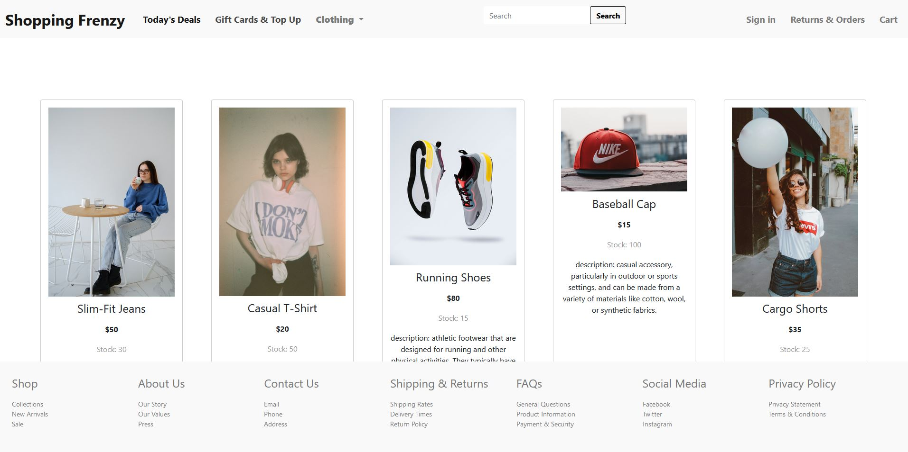
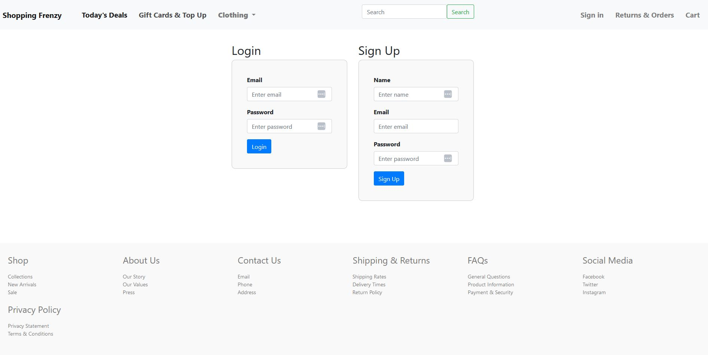

# 🛒Shoppin-Frenzy

## Description

Welcome to Shopping Frenzy Clothing Store! We are an online clothing store that offers a wide range of clothing items for men, women, and children. Our store is designed to provide a convenient and enjoyable shopping experience for our customers.

## Packages Used:

- JavaScript
- dotenv
- express
- mysql2
- sequalize

## Installation:

## Built With

bcrypt - A library to help you hash passwords.
connect-session-sequelize - A library for storing session data in a Sequelize database.
dotenv - A module that loads environment variables from a .env file.
express - A fast, unopinionated, minimalist web framework for Node.js.
express-handlebars - A view engine that lets you render templates in Express.
express-session - A module for managing user sessions in Express.
mysql2 - A MySQL library for Node.js.
sequelize - A promise-based ORM for Node.js.

## Usage:

- Run npm install to install all required dependencies.
- To create the database, run npm run seed.

Node.js
MySQL
Sequelize
Express.js
Express.Handlebars
dotenv
Insomina
Bootstrap

## Contributors:

- Kayhan Mamak - kayhanturk90@live.com - https://github.com/byunn90
- Declan Schembri - declanjschembri@gmail.com - https://github.com/Declxn77
- Lachlan Ferguson - lachieferg98@hotmail.com - https://github.com/Lferg98
- Tania Chahal - tcha0074@student.monash.edu - https://github.com/taniachahal97
